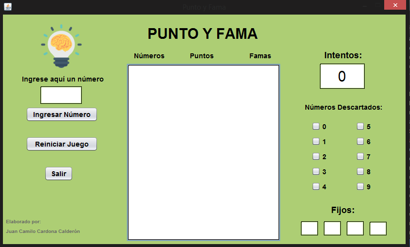
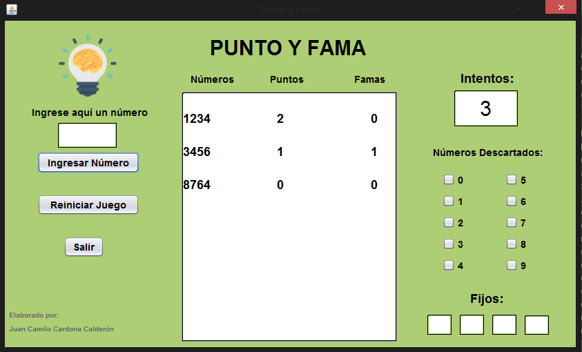
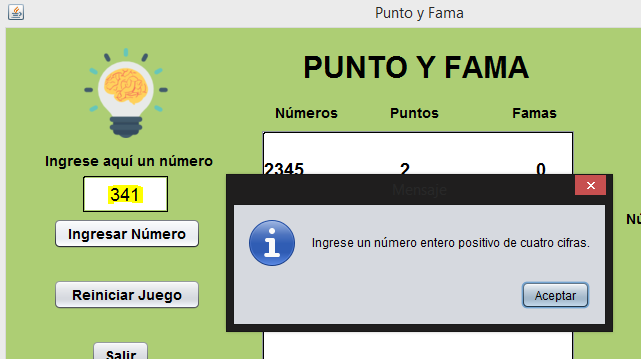
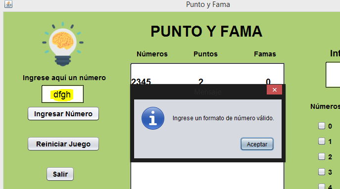
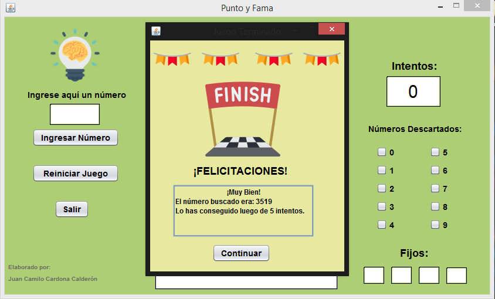

# Proyecto: PUNTO Y FAMA

Saludos
Este es un pequeño proyecto que no utiliza patrones de programación avanzados, es simplemente para poner en práctica la lógica de programación y practicar un poco la programación en JAVA, este proyecto lo implementé para el curso de lógica y representación II de mis estudios superiores universitarios, en el cual se hace uso de listas ligadas simplemente conectadas o también conocidas como simplemente ligadas, tenemos una clase que nos genera un número aleatorio de ciertas características, el cual tenemos que validar. Además tenemos una interfaz gráfica la cual implementé para mostrar de manera cómoda y simple los datos actuales del juego, como lo son el número de intentos, el historial de puntos y famas, los números descartados y los números fijos.

### Reglas de Juego:
1. Al iniciar el juego el programa debe generar un número aleatorio, dicho número aleatorio es de cuatro cifras (El 0 no puede estar en la primera posición) y además tiene todos sus dígitos diferentes.
   
2. El usuario deber ingresar números de cuatro cifras con las mismas características del número aleatorio tratando de adivinarlo.
Cuando un número coincide en valor, pero no en posición con el número aleatorio, será considerado como un punto. Por el contrario, cuando un dígito coincide en valor y en posición con el número aleatorio, éste será considerado como una fama.

3. El usuario deberá apoyarse del historial de puntos y de famas para generar el número aleatorio con el mínimo de intentos posible.


Ahora veremos cómo se desarrollaron algunas de las partes más importantes del proyecto:

### 1. Generación del número aleatorio:

```JAVA
public int numAleatorio()   
{
    Random aleatorio = new Random();
    int numAleatorio = aleatorio.nextInt(10);
    return(numAleatorio);
}

```
El anterior código crea un número aleatorio entre 0 y 10 (No incluye el 10)

Necesitamos crear cuatro números aleatorios, por lo cual se hace el llamado cuatro veces al método y se guardan los valores en un arreglo de enteros, el método para verificar que el número (representado en un arreglo) cumple con las dos características es el siguiente:

```JAVA
public boolean verificarArreglo(int[] vecNumero)
{
int i = 0,j = 1;
if(vecNumero[0] == 0)
{
    return(false);
}
else
{
    while(i < vecNumero.length - 1)
    {
        j = i + 1;
        while(j < vecNumero.length)
        {
            if (vecNumero[i] == vecNumero[j])
            {
                return(false);
            }
            j++;
        }
        i++;
    }
}
return(true);
}

```

El anteior método retorna **true** si el número es válido, de lo contrario retorna false, retorna este valor a un método que **mientras** que no retorne true, seguirá llenando el mismo arreglo con valores diferentes hasta que el número aleatorio representado en el vector sea válido.

```JAVA
public void llenarArreglo(int[] vecNumero)  
{ 
    while(!verificarArreglo(vecNumero))
    {
        for(int i = 0 ; i < 4 ; i++)
        {
            vecNumero[i] = numAleatorio();
        }
    }
}
```

y listo, En la clase nodo tenemos lo siguiente: 

```JAVA
//Atributos clase Nodo
    private int[] numero, aleatorio;
    private int puntos, famas;
    private Nodo liga;  
```
Inmediatamente el usuario ingresa el número, por medio de la clase ListaLigada instanciaremos y ligaremos un nuevo nodo que contendrá los anteriores atributos, en el constructor obtendremos sus puntos y sus famas, con los siguientes métodos:

#### Constructor de la clase Nodo
```JAVA
public Nodo(int[] pNumero, int[] pAleatorio)
{
    numero = pNumero;
    aleatorio = pAleatorio;
    puntos = getPuntos();
    famas = getFamas();
    liga = null;
}

```
Como podemos ver en el constructor se hacen los llamados para obtener los puntos y las famas del número.

#### Obtención de los puntos:
```JAVA
public int getPuntos()
{ 
    int entero = 0;
    for(int i=0; i<4; i++)
    {
        for(int j=0; j<4; j++)
        {
            if((numero[i] == aleatorio[j]) && (i != j)) 
            {
                entero++;
            }
        }
    }
    return(entero);
}
```
Se hace uso de ciclos for anidados, en el cual se debe de preguntar si los números coinciden el valor pero NO en posición

#### Obtención de los puntos:
```JAVA
public int getFamas()
{
    int entero = 0;
    for(int i=0; i<4; i++)
    {
        if(numero[i] == aleatorio[i])
        {
            entero++;
        }
    }
    return(entero);
}
```
Obtener las famas es algo mucho más sencillo, dichos valores, tanto los puntos como las famas se retornan al constructor y se realizan las asignaciones.

###Interfaz Gráfica de Usuario 

Los atributos implementados en la ventana principal son:
```JAVA
private NumAleatorio aleatorio;
private int[] vecNumAleatorio = new int[4];
private int[] vecNumIngresado = new int[4];
private int intentos = 0;
private ListaLigada objListaJuego = new ListaLigada(); 
```

Cada vez que el usuario ingresa un número de cuatro cifras además de que se debe validar que sí sea un número, es decir, su formato numético (manejo de excepciones), se debe de verificar que sí sea de cuatro cifras (numero>1000 y numero<9999) y además que cumpla las dos condiciones de juego, de no cumplir todas estas condiciones no se debe aceptar el número y no se contará el intento, los métodos que hacen esto son los siguientes:

#### Descomposición del número
Luego de pasar el proceso de validación, el número se descompone por dígitos y se lleva a un arreglo de enteros.

```JAVA
private void descomponerNumero(int numero)
{
    int i = 3;
    int aux = numero;
    while(i >= 0)
    {
        vecNumIngresado[i] = aux % 10;
        aux /= 10;
        i--;
    }
}
```

Inmediatamente el usuario ingresa un número, este se debe verificar si el número ingresado coincide con el número aleatorio, en dado caso el juego se terminará y se mostrará la pantalla de finalización, en caso contrario se debe imprimir el número, sus puntos y famas en el textArea principal, así:

### Prueba de funcionamiento:
Se hizo una pequeña configuración para una prueba, no con un número aleatorio, sino con un número conocido el cual será 3519, los resultados son los siguientes: 



Ingresamos algunos cuantos números:


Como podemos ver el número de intentos aumenta, también podemos ir descartando algunos números y fijando otros.

Si se ingresa un número inválido se mostrará cualquiera de los dos siguientes errores: 






Si el usuario ingresa un número que coincide con el número aleatorio se mostrará lo siguiente:



Eso es todo, hasta pronto :flushed: :thumbsup:


